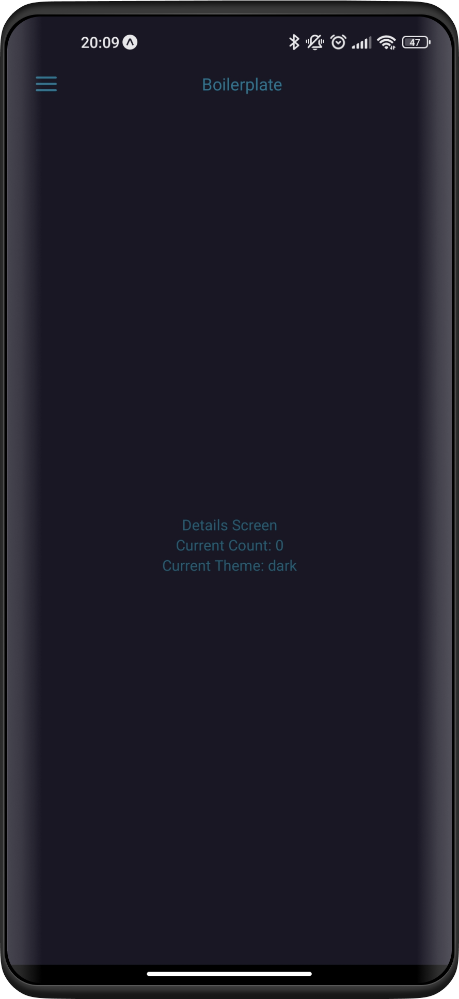
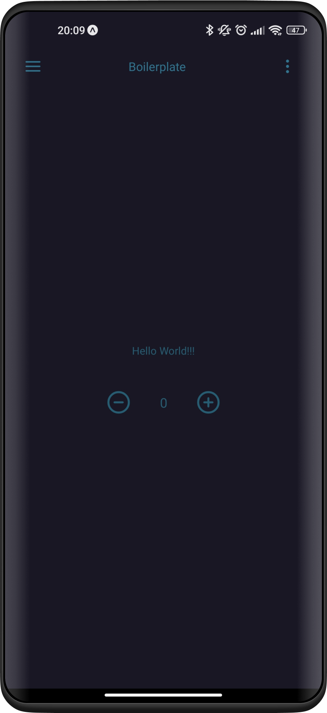
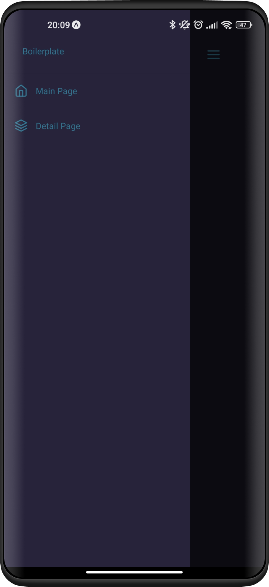
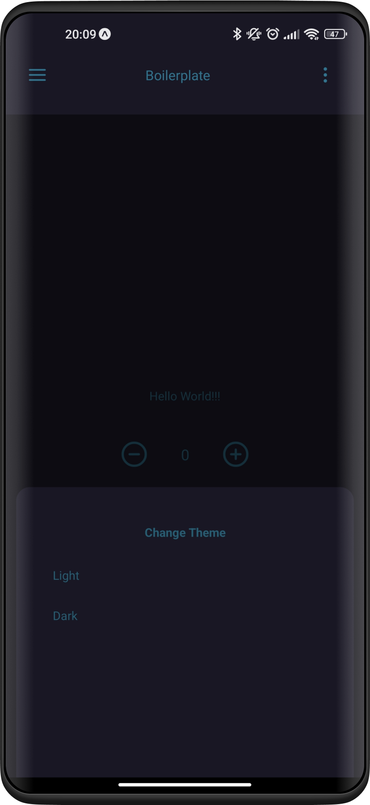
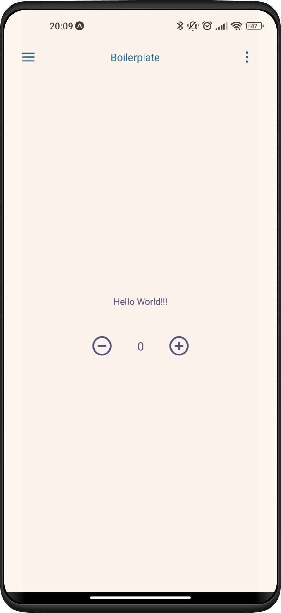
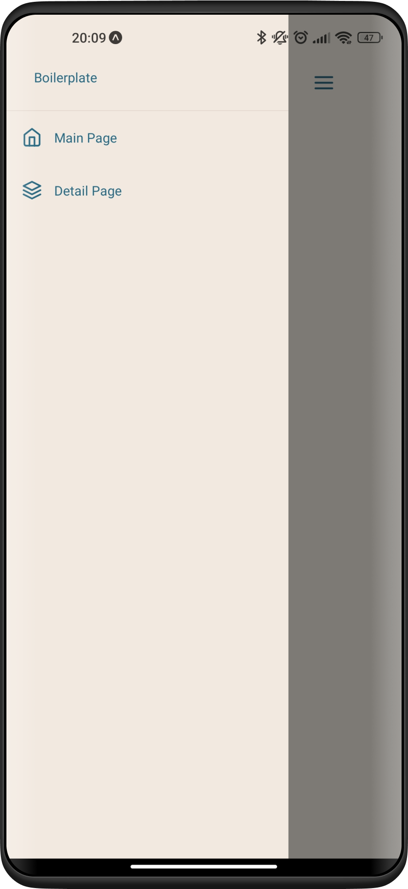
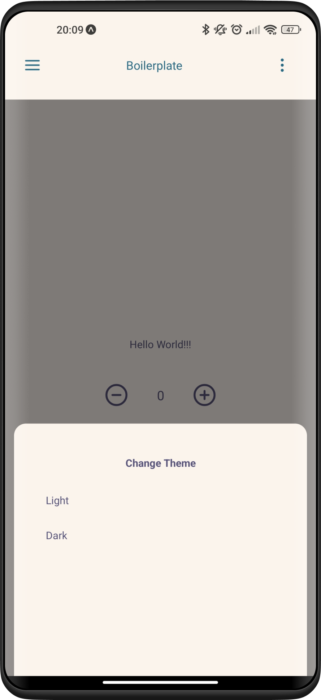

# boilerplate mobile

<p align="center">
  
  
  
  
</p>

<p align="center">
  
  
  
  
</p>

# :zap: Técnologias

- [Expo](https://expo.dev/)
- [jotai](https://jotai.org/)
- [bottom sheet](https://github.com/gorhom/react-native-bottom-sheet)
- [restyle](https://github.com/Shopify/restyle)

# :wrench: Rodando o projeto

```bash
git clone git@github.com:the-spanish-guy/boilerplate-mobile.git boilerplate

cd boilerplate

yarn instal
```

ou clique em `use this template`

# :file_folder: Estrutura do projeto

```
$ tree 
.
├── src
│   │   routes.tsx
│   │
│   │
│   └─── atoms
│   │    ├─── ...
│   |    ├─── Container.tsx
│   |    └─── index.ts
│   |
│   └─── component
│   │    ├─── ...
│   |    ├─── HeaderBar.tsx
│   |    └─── Sidebar.tsx
│   └─── screens
│   |    ├─── Detail.tsx
│   |    └─── Main.tsx
│   └─── states
│   |    ├─── theme.ts
│   |    └─── counter.ts
│   └─── themes
│   │    ├─── ...
│   |    ├─── Dark.ts
│   |    ├─── Light.ts
│   |    └─── index.ts
│   └─── types
│   │    ├─── ...
│   |    └─── SIdebarType.ts
│   └─── routes.tsx
├── ...
├── App.tsxX
└─── README.tsx
```

---
Made by [the spanish guy](https://github.com/the-spanish-guy) with :purple_heart:
